<!-- =========================================================
     VISHAL KENNEDY | GITHUB PROFILE (ANIMATED TERMINAL AESTHETIC)
     PhD Candidate • Policy Analyst • Geospatial • Energy & Environment • AI
========================================================== -->

<h3><code>vkenned2@github ~ $ whoami</code></h3>

<table>
  <tr>
    <td valign="top" align="center" width="370">
      
    </td>
    <td valign="top" align="center" width="490">
      
    </td>
  </tr>
</table>

 

<h3><code>vkenned2@github ~ $ ./contributions.sh</code></h3>

 

<h3><code>vkenned2@github ~ $ ./links.sh</code></h3>

  

  <b>PhD Candidate · Policy Analyst · Researcher · Data-Driven Problem Solver</b> 
  <code>Energy Policy</code> · <code>Environmental Policy</code> · <code>Geospatial Analysis</code> · <code>AI</code> · <code>Program Evaluation</code>

 

---

## <code>vkenned2@github ~ $ cat about.txt</code>

I work at the intersection of policy, spatial evidence, large datasets, and decision-making. My research examines whether the metrics used to evaluate environmental and energy policies actually represent the outcomes policymakers intended.

I build analytical workflows that turn complex environmental and energy data into evidence for researchers, agencies, advocates, and decision-makers.

---

## <code>vkenned2@github ~ $ ./list_projects.sh --featured</code>

### <code>01. National Protected-Areas Representation Pipeline</code>
> **Stack:** `Python` · `R` · `ArcGIS` · `PAD-US` · `USNVC` · `EPA Ecoregions`  
National-scale spatial analysis evaluating whether increases in protected acreage translate into meaningful ecosystem representation.
* Evaluated **210 USNVC vegetation groups** across protected areas.
* Integrated national protected-area and ecological datasets into reproducible analytical workflows.
* Compared strict vs. broad definitions of protection to inform conservation target evaluation.

### <code>02. Appalachian Climate Range Shifts</code>
> **Stack:** `Python` · `R` · `Geospatial Analysis` · `Conservation Policy`  
Climate-driven range-shift analysis examining how wildlife conservation responsibility changes across political boundaries.
* Modeled **270 vertebrate species** across **13 Appalachian states**.
* Constructed pairwise state co-responsibility matrices to identify governance mismatches in species distribution projections.

### <code>03. Clarifying-Question AI Agent</code>
> **Stack:** `JavaScript` · `Node.js` · `Gemini API` · `Prompt Engineering`  
Built for the Google Gemini API Developer Competition. Instead of immediately answering underspecified prompts, the agent asks targeted clarification questions and conditions final API execution on the user's explicit objective.

### <code>04. Automated TEM Analysis</code>
> **Stack:** `Python` · `Machine Learning` · `Autoencoders` · `Scientific Imaging`  
Collaborative microscopy automation work developed through a Mic-Hackathon involving Oak Ridge National Laboratory and the Microscopy Society of America. Explored machine-learning pipelines for automated acquisition and feature recognition in transmission electron microscopy.  
↳ Read the [peer-reviewed publication](https://doi.org/10.1088/2632-2153/ae1f5d)

### <code>05. EcoLeaders Platform Analytics</code>
> **Stack:** `Python` · `Program Evaluation` · `User Research` · `Decision Support`  
Applied engagement analytics and participant research to diagnose retention challenges in a national environmental leadership platform.  
* **Key outcome:** Delivered a **283% increase in engagement** compared with the previous program cycle.

### <code>06. Environmental Compliance & Management</code>
> **Stack:** `EMS` · `ISO 14001` · `RCRA` · `Environmental Reporting` · `Sustainability`  
BMW-aligned environmental compliance work focused on translating regulatory requirements into practical environmental-management systems for industrial settings.
* Contributed to Environmental Management System (EMS) documentation aligned with ISO 14001.
* Developed dashboards for tracking compliance indicators and hazardous-waste protocols under RCRA.

---

## <code>vkenned2@github ~ $ neofetch --stack</code>

| Category | Tools & Technologies |
| :--- | :--- |
| **Languages** | `Python` · `R` · `JavaScript` · `SQL` |
| **Data & ML** | `Pandas` · `NumPy` · `scikit-learn` · `Statistical Modeling` |
| **Geospatial** | `ArcGIS` · `QGIS` · `Spatial Analysis` |
| **Policy Analytics** | `STATA` · `Program Evaluation` · `Causal Inference` |
| **Visualization** | `Tableau` · `Power BI` |
| **Engineering** | `Git` · `GitHub` · `GitHub Actions` · `Node.js` |

---

## <code>vkenned2@github ~ $ cat research_focus.matrix</code>

<table>
<tr>
<td width="50%" valign="top">

### ⚡ Energy
* Transmission and interconnection
* Clean-energy deployment
* Electricity-market design
* EV charging infrastructure
* Renewable-energy integration

</td>
<td width="50%" valign="top">

### 🌲 Environment
* Protected-area effectiveness
* Biodiversity conservation
* Climate adaptation
* Land-use trade-offs
* Environmental regulation

</td>
</tr>
<tr>
<td width="50%" valign="top">

### 📊 Policy Analytics
* Causal inference
* Program evaluation
* Regulatory design
* Spatial policy analysis
* Evidence-to-decision translation

</td>
<td width="50%" valign="top">

### 💻 Technology
* Geospatial analytics
* Machine learning
* Scientific automation
* AI-assisted research
* Reproducible analytical pipelines

</td>
</tr>
</table>

---

## <code>vkenned2@github ~ $ ./education.sh</code>

* **University of Tennessee, Knoxville**  
  `PhD, Ecology` — Energy & Environmental Policy *(2022–2027 expected)*  
  *Focus:* protected areas · conservation policy · energy policy · spatial analysis · decision science

* **Indian Institute of Science Education and Research, Kolkata**  
  `BS + MS, Ecology` — Integrated 5-Year Program *(2016–2021)*

---

## <code>vkenned2@github ~ $ ./awards.sh --recent</code>

| Year | Recognition |
| :--- | :--- |
| **2026** | **UNESCO MAB Young Scientist Award**, Nominee |
| **2026** | **U.S. Biosphere Network**, Youth Board |
| **2026** | **Tom Gilbert Award**, Baker School |
| **2026** | **Real Brown Award**, Ecological Society of America |
| **2025** | **EcoLeaders Community Research Fellowship**, National Wildlife Federation |
| **2025** | **Peer-Reviewed Publication**, *Machine Learning: Science and Technology* |

<b>Additional Fellowships & Honors</b>

 

* William Bryne-Hartz Fellowship
* A.J. and Evelyn Sharp Award
* Breedlove-Dennis Award
* SDURI Fellowship, University of Western Australia
* INSPIRE Fellowship, Government of India
* DST Fellowship, Government of India
* Policy Writing Memo Award, National Wildlife Federation
* Mic-Hackathon Award, Oak Ridge National Laboratory & MSA

---

### <code>vkenned2@github ~ $ status --opportunities</code>

**Open to internships and full-time opportunities beginning in 2027.**

 

